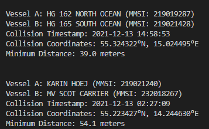
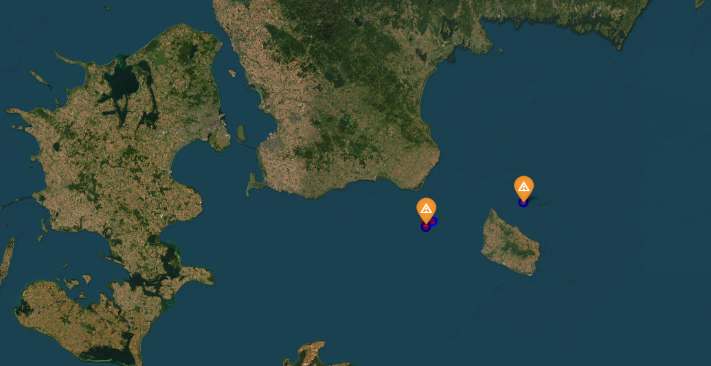
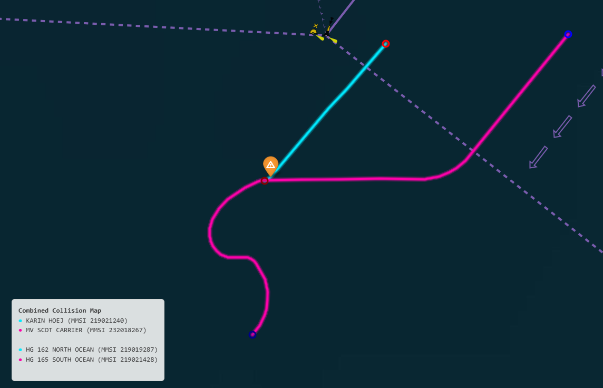
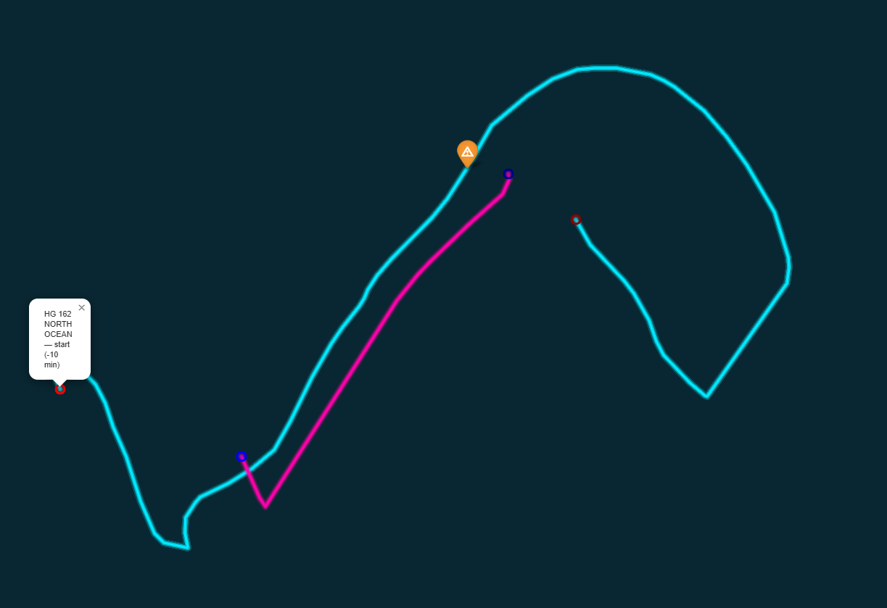

# AIS Vessel Collision Detection Pipeline

Detects and visualizes vessel collisions using Apache Spark and Danish AIS (Automatic Identification System) data from December 2021.

## What It Does

- Processes millions of AIS records from the Baltic Sea region
- Identifies vessel collisions using physics-based DCPA/TCPA calculations
- Filters for Class A vessels only, moving vessels (SOG > 1.0 knot)
- Excludes port zones and undefined/pilot ships
- Generates interactive collision maps with vessel trajectories
- Outputs collision data: MMSI, vessel names, timestamps, coordinates, distance (meters)
- Chech output in output folder

## Prerequisites

- Docker & Docker Compose
- 2+ GB RAM available
- ~500 MB disk space for output results
- AIS CSV files (you provide them)

## Quick start

### Using docker compose (main recomendation)

```bash
# Clone repository
git clone <repo-url>

# Create data directory and add CSV files
mkdir -p aisdk-2021-12
# Copy your AIS CSV files here:
# cp /path/to/aisdk-2021-12-*.csv aisdk-2021-12/

# Build and run
docker-compose up --build

# Check results
ls -la output/
```

### Using Docker Hub

```bash
# Pull from Docker Hub
docker pull itsmantas/ais-collision-detection:latest

# Create data directory
mkdir -p aisdk-2021-12
# Add CSV files to aisdk-2021-12/    FOR TESTING PURPOSES ENSURE IT IS 2021-12-13 as it is designed now to test that by default if you want to replicate results

# Run
docker run -v ./aisdk-2021-12:/app/aisdk-2021-12:ro \
           -v ./output:/app/output \
           itsmantas/ais-collision-detection:latest

# if didn't work use/run this will run pipeline in docker `docker-compose up`
But ensure you have only day 2021-12-13 because might take a long time with full dataset!
```


### Local development (without docker)

```bash
# Setup
python -m venv .venv
source .venv/bin/activate  # Windows: .venv\Scripts\activate
pip install -r requirements.txt

# Create data directory
mkdir -p aisdk-2021-12
# Add CSV files to aisdk-2021-12/

# Run
python app/main.py           # Full pipeline
python app/main.py -d 13     # Test with Dec 13 (if CSV exists)
```

## Output

- **collision_map.html** - Interactive map with vessel trajectories, in output folder

## Architecture

- **Data Loading** - Processes AIS CSV files with 26-column schema
- **Data Cleaning** - Various filtering
- **Collision Detection** - Spatial grid indexing + DCPA/TCPA
- **Visualization** - Folium maps with +-10 minute vessel trajectories
- **Containerized** - Docker image

## Configuration

Edit `app/config.py` to adjust:
- `COLLISION_THRESHOLD_NM = 0.03` 
- `MAX_DISTANCE_FILTER_NM = 0.054` 
- `SEARCH_RADIUS_NM = 50` (geographic area)
- `MIN_SOG = 1.0` (minimum vessel speed)

## Support

For issues, check the logs directory or run with `-d 13` sample mode for quick testing.

## Troubleshooting


### Out of memory errors
- Reduce `spark.sql.shuffle.partitions` in config.py
- Increase driver/executor memory in docker-compose.yml

### Docker build fails
- Ensure Java is available: `java -version`
- Check disk space for build cache

---

## 📝 Example Results

```
────────────────────────────────────────────────────────────────
Vessel A: KARIN HOEJ (MMSI: 219021240)
Vessel B: MV SCOT CARRIER (MMSI: 232018267)
Collision Timestamp: 2021-12-13 02:27:09
Collision Coordinates: 55.223427°N, 14.244630°E
Minimum Distance: 54.1 meters
────────────────────────────────────────────────────────────────
```




real collision


wrong, fishing vessels


---

## References

- **Liu et al. (2023)**: AIS error detection overall overview
- **ITU-R M.585-9**: MMSI allocation and validation https://www.itu.int/dms_pubrec/itu-r/rec/m/R-REC-M.585-10-202604-I!!PDF-E.pdf first pages
- **H3**: Hierarchical geospatial indexing system
- **COLREG**: Was also considered implementing but not correctly, therefore there might be some placeholder code in repo. For more info on COLREG rules check https://www.imo.org/en/ourwork/safety/pages/preventing-collisions.aspx

---


## Additional info

For issues, questions, or improvements:
1. Check REPORT.md for detailed methodology
2. This work correctly checks the vessel collision on December 13 2021, betweeen 219021240 and 232018267 MMSIs, but also catches fshing boats that are very near, therefore this pipeline could be used for coalision detection but its accuracy is questionable as vessels can be close to each other and code mistakenly finds it as collision. but it can be verified with html map.

---

